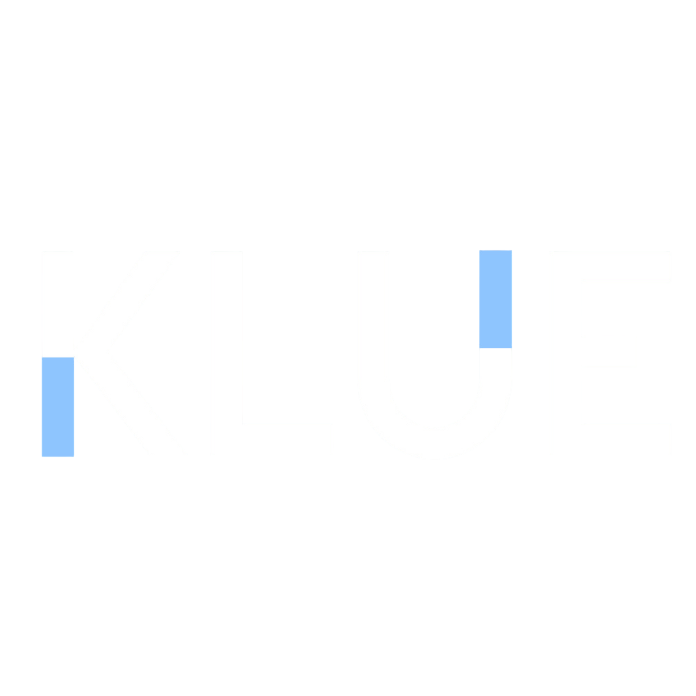

This is the official Android client for Klue, a smart banking app that helps users open accounts, earn XP, receive personalized recommendations, and benefit from contextual notifications and partner offers.

---

## App Overview

- **Built with:** Kotlin, Jetpack Compose, MVVM architecture.
- **Features:** Onboarding, KYC verification, account management, transactions, XP tiers, partner perks, geofence and BLE-triggered notifications, personalized recommendations.
- **Backend:** Communicates securely with Klue's microservices via REST API.

---

## Core User Flows

### Authentication

Managed by **AuthViewModel**
- Register and login.
- Token refresh and validation.

### Onboarding & KYC

Managed by **ServiceFlowViewModel**, **KycViewModel**, **AccountViewModel**
- New users onboard through KYC verification and initial account setup.
- Handles document upload and identity validation.

### Account Management

Managed by **AccountViewModel**
- View active accounts.
- Create or close accounts.
- View account details.

### Transactions

Managed by **TransactionViewModel**
- Transfer money between accounts.
- Make purchases that earn XP.
- View transaction history.

### XP & Rewards

Managed by **HomeScreenViewModel**
- See XP balance and tier status.
- Visualize how purchases and actions affect XP.

### Recommendations

Managed by **RecommendationViewModel**
- Receive recommended account products and perks.
- Geofence or BLE events can trigger new offers.

### Notifications

Managed by **NotificationViewModel**
- Receive push notifications.
- Geofencing and BLE beacons send contextual messages.
- Register device for FCM tokens.

---

## Permissions

- **Location:** Required for geofencing to detect when the user enters partner areas.
- **Bluetooth:** Required for BLE beacon triggers in partner stores.
- **Notifications:** Required for push updates on offers and account activity.

---

## Tech Stack

- **Language:** Kotlin
- **UI:** Jetpack Compose with custom theme and typography
- **Architecture:** MVVM
- **Networking:** Retrofit

---

## Future Work

- Biometric login
- Offline caching
- Better notification settings

---

For any questions, see [our backend API documentation](https://github.com/Alkandari-Y/NBK-CODED-Capstone-Spring/blob/main/README.md) for full endpoint details.